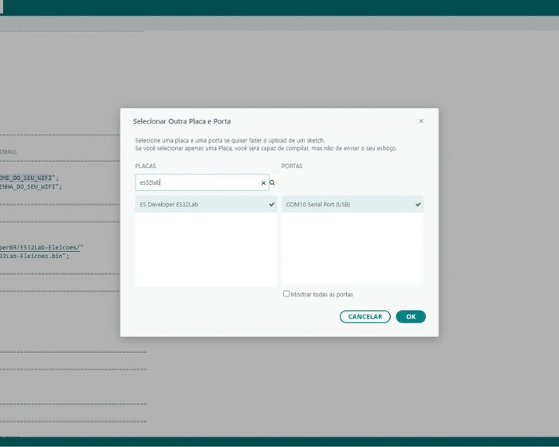
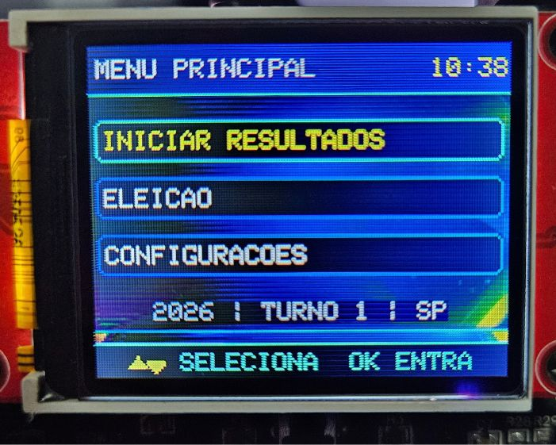
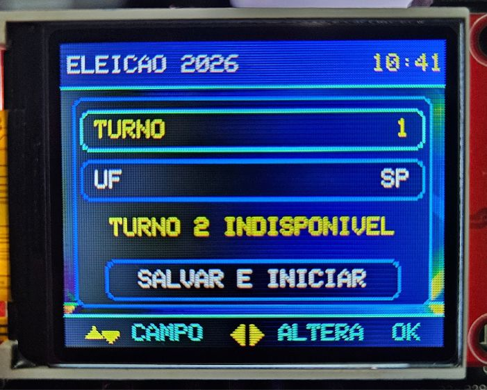
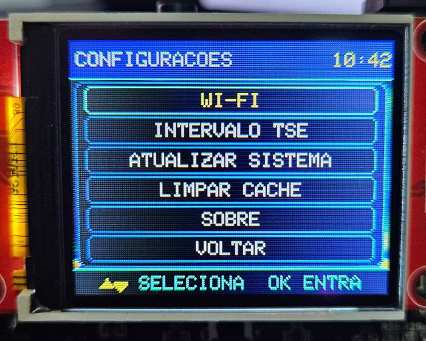
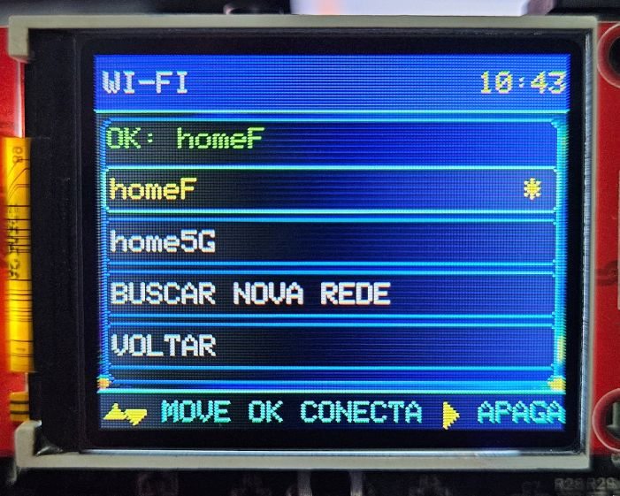
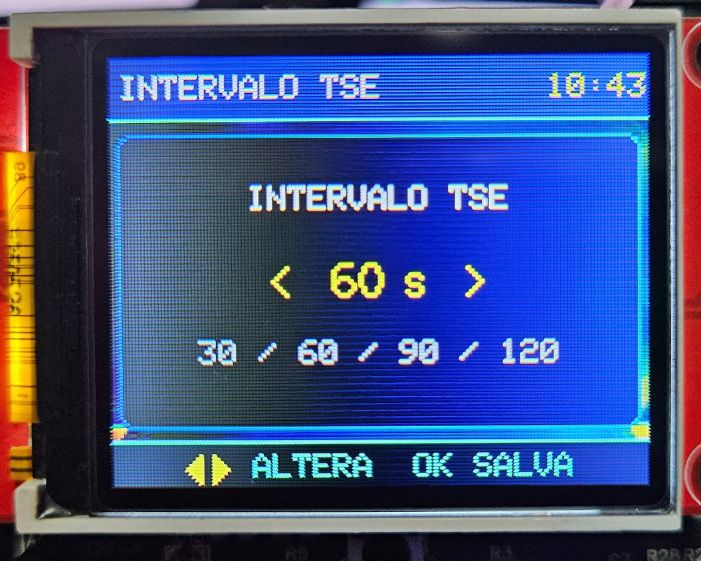
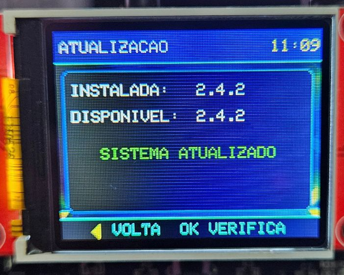

# ES32Lab Eleições 2026

<p align="center">
  
</p>

O **ES32Lab Eleições 2026** transforma a **ES32Lab** em um terminal conectado para acompanhamento dos resultados das Eleições 2026, utilizando **dados públicos disponibilizados pelo Tribunal Superior Eleitoral (TSE)** e apresentando as informações diretamente no display colorido da placa.

O projeto foi desenvolvido e testado com o **[Kit ES32Lab Plus](https://www.esdeveloper.com.br/es32lab-plus)**, que reúne a **ES32Lab, ESP32 e display TFT colorido** em um conjunto pronto para estudo, desenvolvimento e prototipagem.

A proposta vai além de exibir resultados: este projeto demonstra, em uma aplicação real, como a **ES32Lab** pode integrar conexão Wi-Fi, comunicação HTTPS, processamento de JSON, interface gráfica, armazenamento local, atualização remota de firmware e interação pelo teclado da própria placa.

> **ES Developer:** [www.esdeveloper.com.br](https://www.esdeveloper.com.br/)  
> **Kit utilizado neste projeto:** [Kit ES32Lab Plus](https://www.esdeveloper.com.br/es32lab-plus)  
> **Instalador mais recente:** [Baixar ES32Lab Eleições](https://github.com/ESDeveloperBR/ES32Lab-Eleicoes/releases/latest/download/ES32Lab_Eleicoes_Installer.zip)  
> **Configuração da Arduino IDE:** [Tutorial oficial da ES Developer](https://www.esdeveloper.com.br/como-instalar-e-configurar-arduino-ide)

---

## Índice

1. [Instalação rápida](#instalação-rápida)
2. [O que é o ES32Lab Eleições 2026](#o-que-é-o-es32lab-eleições-2026)
3. [Principais recursos](#principais-recursos)
4. [Como os dados do TSE são utilizados](#como-os-dados-do-tse-são-utilizados)
5. [Inicialização do sistema](#inicialização-do-sistema)
6. [Menu Principal](#menu-principal)
7. [Configuração da eleição](#configuração-da-eleição)
8. [Telas de resultados](#telas-de-resultados)
9. [Tela Status](#tela-status)
10. [Configurações](#configurações)
    - [Wi-Fi](#wi-fi)
    - [Intervalo TSE](#intervalo-tse)
    - [Atualizar Sistema](#atualizar-sistema)
    - [Limpar Cache](#limpar-cache)
    - [Sobre](#sobre)
11. [Navegação pela ES32Lab](#navegação-pela-es32lab)
12. [Como o código funciona internamente](#como-o-código-funciona-internamente)
13. [Armazenamento e cache](#armazenamento-e-cache)
14. [Atualizações do aplicativo](#atualizações-do-aplicativo)
15. [Por que a ES32Lab neste projeto](#por-que-a-es32lab-neste-projeto)
16. [Observações importantes sobre os resultados](#observações-importantes-sobre-os-resultados)
17. [Links úteis](#links-úteis)

---

## Instalação rápida

A maneira recomendada de instalar o projeto é utilizando o **instalador oficial**. Ele foi preparado para simplificar a primeira gravação da ES32Lab: o usuário informa sua rede Wi-Fi, envia o instalador para a placa e o próprio instalador busca a versão mais recente do aplicativo.

### O que você precisa

- Uma **ES32Lab** com ESP32 e display TFT colorido. Para reproduzir o mesmo conjunto utilizado no desenvolvimento, recomendamos o **[Kit ES32Lab Plus](https://www.esdeveloper.com.br/es32lab-plus)**.
- Um cabo USB compatível com o ESP32 utilizado.
- Um computador com acesso à internet.
- Uma rede Wi-Fi compatível com o ESP32.
- A Arduino IDE configurada para a ES32Lab.

Se ainda não preparou a Arduino IDE, siga primeiro o tutorial oficial:

**[Como instalar e configurar a Arduino IDE para ESP32, ES32Lab e bibliotecas](https://www.esdeveloper.com.br/como-instalar-e-configurar-arduino-ide)**

Esse tutorial mostra a instalação da Arduino IDE, do pacote **ESP32 by Espressif Systems**, da biblioteca oficial da **ES32Lab**, a seleção da placa e da porta de comunicação.

> Para a definição oficial da placa aparecer diretamente na Arduino IDE, utilize o pacote **ESP32 by Espressif Systems 3.3.11 ou superior** e selecione **ES Developer ES32Lab**.

### 1. Baixe o instalador

Baixe sempre o pacote mais recente:

**[Baixar ES32Lab_Eleicoes_Installer.zip](https://github.com/ESDeveloperBR/ES32Lab-Eleicoes/releases/latest/download/ES32Lab_Eleicoes_Installer.zip)**

Descompacte o arquivo ZIP em uma pasta do computador e mantenha os arquivos extraídos juntos.

### 2. Abra o instalador na Arduino IDE

Abra o arquivo:

```text
ES32Lab_Eleicoes_Installer.ino
```

### 3. Informe o nome e a senha do Wi-Fi

No início do código do instalador existem duas linhas destinadas ao usuário:

```cpp
const char* WIFI_SSID     = "NOME_DO_SEU_WIFI";
const char* WIFI_PASSWORD = "SENHA_DO_SEU_WIFI";
```

Substitua somente os textos entre aspas pelo nome da sua rede e pela senha correspondente.

> **Importante:** não publique nem compartilhe arquivos contendo sua senha real de Wi-Fi.

<p align="center">
  
</p>

### 4. Selecione a ES32Lab e a porta

Na Arduino IDE, selecione:

```text
ES Developer ES32Lab
```

e escolha a porta COM correspondente ao ESP32 conectado à ES32Lab.

<p align="center">
  
</p>

### 5. Compile e envie

Clique em **Carregar** na Arduino IDE. O código será compilado e gravado no ESP32.

Depois da inicialização, o instalador:

1. conecta-se ao Wi-Fi informado;
2. grava as credenciais de rede na memória não volátil do ESP32;
3. acessa o firmware oficial mais recente;
4. faz o download e a instalação;
5. mostra o andamento no display da ES32Lab;
6. reinicia a placa já executando o **ES32Lab Eleições**.

As credenciais de Wi-Fi informadas no instalador permanecem salvas. Por isso, quando o aplicativo principal inicia pela primeira vez, ele já pode utilizar a mesma rede sem pedir novamente o SSID e a senha.

Depois da primeira instalação, as futuras atualizações normalmente podem ser feitas pela própria interface do aplicativo, sem repetir todo esse procedimento no computador.

---

## O que é o ES32Lab Eleições 2026

O **ES32Lab Eleições 2026** é uma aplicação criada para demonstrar o uso da **ES32Lab** em um projeto conectado, com dados reais disponibilizados publicamente na internet.

A aplicação consulta os serviços públicos de resultados eleitorais disponibilizados pelo TSE, interpreta as informações recebidas e transforma os dados em telas adequadas ao display TFT da ES32Lab.

Nesta versão, o projeto está focado nas **Eleições 2026**.

A ES32Lab não calcula, altera ou projeta resultados. Ela atua como um dispositivo cliente: conecta-se à internet, consulta a fonte pública e apresenta localmente as informações recebidas.

O projeto é independente e **não é um sistema oficial do TSE, não representa o TSE e não possui vínculo institucional com o Tribunal Superior Eleitoral**.

---

## Principais recursos

- Consulta de dados públicos disponibilizados pelo TSE.
- Acompanhamento das Eleições 2026 diretamente no display da **ES32Lab**.
- Seleção de UF e turno.
- Verificação da disponibilidade real do segundo turno.
- Telas específicas para Presidente, Governador, Senador e Deputado Estadual ou Distrital.
- Tela de Status para acompanhamento do funcionamento do sistema.
- Conexão Wi-Fi com armazenamento das redes configuradas.
- Busca de novas redes diretamente pela interface da ES32Lab.
- Configuração do intervalo de atualização dos dados.
- Sincronização de horário pela internet.
- Armazenamento local de fotografias utilizadas pela aplicação.
- Atualização do firmware pela internet.
- Verificação de nova versão durante a inicialização.
- Processamento de rede separado da interface para manter a navegação responsiva.
- Atualização inteligente da tela, evitando redesenhos quando os dados visíveis não mudaram.

---

## Como os dados do TSE são utilizados

A origem dos dados eleitorais é a infraestrutura pública disponibilizada pelo Tribunal Superior Eleitoral no domínio:

**[https://resultados.tse.jus.br/](https://resultados.tse.jus.br/)**

O aplicativo trabalha com endereços oficiais sob:

```text
https://resultados.tse.jus.br/oficial/
```

A lógica geral funciona da seguinte maneira:

```text
Internet
   |
   v
Serviços públicos do TSE
   |
   v
Consulta HTTPS pela ES32Lab
   |
   v
Leitura e interpretação dos JSONs
   |
   v
Dados organizados por cargo / turno / UF
   |
   v
Interface gráfica no display TFT
```

Antes de consultar os resultados, o aplicativo também verifica a configuração eleitoral publicada pelo TSE. Isso é especialmente importante para o **segundo turno**.

O programa não considera que o segundo turno está disponível apenas porque existe uma previsão interna para ele. A opção só é liberada quando a configuração oficial consultada indica que aquele turno está efetivamente disponível.

No primeiro turno, a aplicação pode apresentar:

- Presidente;
- Governador da UF selecionada;
- Senador da UF selecionada;
- Deputado Estadual da UF selecionada;
- Deputado Distrital quando a UF escolhida for o Distrito Federal;
- Status do sistema.

No segundo turno, quando oficialmente disponível, a aplicação trabalha com os cargos aplicáveis, como Presidente e Governador.

---

## Inicialização do sistema

Ao ligar a ES32Lab, o aplicativo executa uma sequência automática de preparação.

Durante essa etapa são inicializados o display, os recursos necessários da placa, o sistema de arquivos, as configurações salvas e a conexão Wi-Fi.

Se já existir uma rede válida armazenada, o aplicativo tenta conectar automaticamente.

Se não existir uma conexão utilizável, o usuário pode acessar a busca de redes e configurar uma nova conexão diretamente pela ES32Lab.

Durante a inicialização, quando existe acesso à internet, o sistema também verifica se há uma versão mais recente do aplicativo disponível. Se encontrar uma nova versão, o usuário pode ser direcionado para a tela de atualização.

A atualização **não é instalada automaticamente sem confirmação**.

---

## Menu Principal

O Menu Principal concentra os três caminhos principais da aplicação:

- **INICIAR RESULTADOS** — abre as telas de acompanhamento eleitoral;
- **ELEIÇÃO** — permite selecionar turno e UF;
- **CONFIGURAÇÕES** — acesso ao Wi-Fi, intervalo de consulta, atualização do sistema, cache e informações do aplicativo.

<p align="center">
  
</p>

Na parte inferior da tela, a própria interface informa quais controles estão disponíveis naquele momento.

---

## Configuração da eleição

A tela **Eleição 2026** permite definir os parâmetros principais do acompanhamento.

O usuário pode selecionar:

- **Turno**;
- **UF**;
- **Salvar e Iniciar**.

<p align="center">
  
</p>

A aplicação guarda a última UF utilizada para facilitar os próximos acessos.

### Segundo turno

A mensagem **TURNO 2 INDISPONÍVEL** significa que, naquele momento, o aplicativo ainda não encontrou a publicação oficial necessária para habilitar o segundo turno.

Essa verificação evita que o sistema tente consultar resultados que ainda não foram disponibilizados.

---

## Telas de resultados

Ao selecionar **Iniciar Resultados**, o usuário pode navegar entre os cargos disponíveis para a eleição configurada.

A aplicação organiza cada resposta recebida do TSE e mantém uma estrutura local com as informações necessárias para desenhar a tela.

### Presidente

Apresenta os dados nacionais para o cargo de Presidente.

Quando a fotografia oficial correspondente está disponível para a aplicação, ela pode ser armazenada localmente e utilizada na interface.

### Governador

Apresenta os dados de Governador para a UF selecionada.

Assim como na tela de Presidente, a aplicação pode utilizar fotografia armazenada localmente quando o recurso estiver disponível.

### Senador

Apresenta os candidatos e os dados recebidos para o cargo de Senador na UF selecionada.

Como esse tipo de disputa pode exigir uma quantidade maior de informações, a interface utiliza apresentação adequada ao espaço disponível no display.

### Deputado Estadual / Deputado Distrital

Para os estados, a aplicação consulta os dados de Deputado Estadual.

Quando a UF configurada é o Distrito Federal, o aplicativo utiliza o cargo correspondente de Deputado Distrital.

### Atualização das telas

As consultas ao TSE acontecem periodicamente em segundo plano.

A interface não precisa ser redesenhada toda vez que outro cargo recebe uma atualização. O aplicativo identifica qual conjunto de dados mudou e redesenha somente quando a informação relevante para a tela atual realmente foi alterada.

Isso mantém a navegação mais estável e reduz atualizações visuais desnecessárias.

---

## Tela Status

A tela **Status** foi criada para oferecer uma visão rápida do funcionamento da aplicação.

Ela reúne informações úteis para acompanhamento e diagnóstico, como:

- situação da conexão Wi-Fi;
- eleição, turno e UF selecionados;
- horário do sistema;
- intervalo configurado para as consultas;
- estado das operações de atualização;
- informações de memória e armazenamento utilizadas pelo aplicativo;
- versão do sistema.

O horário é sincronizado pela internet e ajustado conforme a configuração utilizada pela aplicação.

Essa tela é especialmente útil para confirmar se a ES32Lab está conectada e se o sistema continua executando normalmente mesmo enquanto o usuário navega pelas demais páginas.

---

## Configurações

A tela **Configurações** reúne os principais ajustes do aplicativo.

<p align="center">
  
</p>

As opções disponíveis são:

- Wi-Fi;
- Intervalo TSE;
- Atualizar Sistema;
- Limpar Cache;
- Sobre;
- Voltar.

### Wi-Fi

A opção **Wi-Fi** permite visualizar as redes armazenadas e configurar uma nova conexão diretamente pela ES32Lab.

<p align="center">
  
</p>

A interface permite selecionar uma rede já cadastrada, apagar uma configuração antiga ou iniciar uma nova busca.

Quando uma nova rede é selecionada, o usuário pode informar a senha utilizando o teclado da própria ES32Lab.

Depois de uma conexão manual bem-sucedida, o aplicativo apresenta uma confirmação com informações da conexão, como o SSID e o endereço IP, e retorna à navegação normal.

As credenciais ficam armazenadas em memória não volátil, portanto continuam disponíveis após desligar a placa ou atualizar o aplicativo.

Se o projeto tiver sido instalado pelo **instalador oficial**, o SSID e a senha definidos na Arduino IDE já são gravados para que o aplicativo principal possa utilizá-los depois da instalação.

### Intervalo TSE

A opção **Intervalo TSE** define com que frequência o sistema inicia uma nova rodada periódica de consulta aos dados eleitorais.

As opções atuais são:

```text
30 / 60 / 90 / 120 segundos
```

<p align="center">
  
</p>

Um intervalo menor produz consultas mais frequentes. Um intervalo maior reduz a quantidade de requisições.

O valor escolhido fica salvo para os próximos usos.

A atualização ocorre em segundo plano para que a interface continue respondendo enquanto novas informações são obtidas.

### Atualizar Sistema

A opção **Atualizar Sistema** permite verificar se existe uma versão mais recente do ES32Lab Eleições.

<p align="center">
  
</p>

A tela informa:

```text
INSTALADA:   versão atual
DISPONÍVEL:  versão encontrada
```

Quando as versões são iguais, o sistema informa que já está atualizado.

Quando existe uma nova versão, por exemplo:

```text
INSTALADA:   2.4.1
DISPONÍVEL:  2.4.2
```

o usuário pode confirmar a atualização.

O firmware é então obtido pela internet, gravado pelo mecanismo de atualização do ESP32 e, ao final, a ES32Lab reinicia executando a nova versão.

As configurações de Wi-Fi e demais dados persistentes foram organizados para permanecer disponíveis durante as atualizações normais do aplicativo.

### Limpar Cache

A opção **Limpar Cache** remove os arquivos temporários utilizados para armazenar fotografias da aplicação.

Ela é útil quando o usuário deseja forçar um novo download desses recursos ou liberar o espaço utilizado por eles.

Limpar esse cache **não equivale a apagar as redes Wi-Fi configuradas**.

Quando uma fotografia for necessária novamente, o sistema poderá obtê-la outra vez pela internet.

### Sobre

A tela **Sobre** reúne informações de identificação do aplicativo e do ambiente utilizado, incluindo dados como:

- nome do projeto;
- versão instalada;
- data de compilação;
- versões dos componentes principais de software;
- referência à ES32Lab;
- indicação da origem dos dados eleitorais.

É a tela indicada para confirmar rapidamente qual versão do ES32Lab Eleições está instalada na placa.

---

## Navegação pela ES32Lab

O projeto utiliza o teclado integrado à **ES32Lab** como interface de controle.

De forma geral:

- **Cima / Baixo** percorrem itens ou alteram valores;
- **Esquerda / Direita** podem mudar campos, páginas ou valores conforme a tela;
- **OK / tecla central** confirma a opção selecionada.

A função exata de cada tecla pode mudar conforme o contexto. Por isso, o rodapé do display mostra os comandos disponíveis em cada tela.

A interface foi pensada para que a aplicação funcione de maneira independente depois da instalação: não é necessário manter um computador conectado para navegar, trocar a UF, ajustar o intervalo, configurar uma nova rede ou verificar atualizações.

---

## Como o código funciona internamente

O programa principal foi organizado para dividir as responsabilidades da aplicação e evitar que operações de internet prejudiquem a interface gráfica.

De forma simplificada, a arquitetura pode ser entendida assim:

```text
                     +----------------------+
                     |  Interface ES32Lab   |
                     | Display + Teclado    |
                     +----------+-----------+
                                |
                                v
                     +----------------------+
                     | Estado da aplicação  |
                     | Tela / UF / Turno    |
                     +----------+-----------+
                                |
               +----------------+----------------+
               |                                 |
               v                                 v
      +------------------+              +------------------+
      | Tarefa de rede   |              | Armazenamento    |
      | HTTPS / TSE      |              | NVS / arquivos   |
      +--------+---------+              +------------------+
               |
               v
      +------------------+
      | Parser dos JSONs |
      +--------+---------+
               |
               v
      +------------------+
      | Dados por cargo  |
      +------------------+
```

### Interface gráfica

O display TFT da ES32Lab apresenta menus, informações eleitorais, mensagens de estado e telas de configuração.

O código mantém um estado indicando qual tela está ativa. A partir desse estado, as teclas executam as ações adequadas e a interface é redesenhada somente quando necessário.

Essa abordagem também ajuda a evitar piscadas e redesenhos desnecessários.

### Leitura do teclado

O teclado analógico integrado à ES32Lab é utilizado para toda a navegação.

O programa diferencia ações como pressionar, soltar e manter uma tecla pressionada, permitindo usar os mesmos controles em menus, seleção de campos e edição de senha.

### Controle de tempo

Vários processos dependem de intervalos:

- atualização dos resultados;
- tempo mínimo das telas de inicialização;
- mensagens temporárias;
- tentativas de conexão;
- sincronização da interface;
- atualização de relógio.

Esses eventos são controlados sem transformar o funcionamento normal da aplicação em uma sequência de esperas longas que bloqueiem a navegação.

### Tarefa de rede

As consultas de internet são executadas separadamente do fluxo principal da interface.

Isso é importante porque uma resposta HTTPS pode levar algum tempo para chegar. Se toda a operação fosse feita diretamente no mesmo fluxo responsável pelo display e teclado, a ES32Lab poderia parecer travada enquanto aguardasse a internet.

Com a separação da tarefa de rede, a interface consegue continuar respondendo durante boa parte dessas operações.

### Consulta dos resultados

Para cada ciclo de atualização, o programa identifica:

1. eleição configurada;
2. turno;
3. UF;
4. cargo a consultar;
5. endereço oficial correspondente;
6. dados recebidos;
7. alterações relevantes para a interface.

Os resultados são processados cargo por cargo.

A chegada de uma atualização de Senador, por exemplo, não exige redesenhar a tela de Presidente caso o usuário esteja visualizando Presidente e os dados dessa tela não tenham mudado.

### Processamento de JSON

Os serviços eleitorais fornecem uma quantidade significativa de informações.

Para reduzir o uso de memória do ESP32, o projeto evita depender de uma grande cópia completa de todas as informações sempre que possível. Os dados necessários são extraídos e organizados em estruturas menores, apropriadas para a interface da ES32Lab.

O processamento candidato por candidato também ajuda a manter o consumo de RAM sob controle.

### Fotografias

As fotografias utilizadas nas telas aplicáveis, como Presidente e Governador, podem ser obtidas pela internet e armazenadas localmente.

O sistema prioriza a fotografia necessária para a tela atual. Quando a aplicação está ociosa, pode antecipar o carregamento do próximo recurso para tornar a navegação mais fluida.

Uma fotografia já armazenada não precisa ser baixada novamente a cada atualização dos resultados.

### Relógio

Depois de estabelecer conexão com a internet, o aplicativo sincroniza o horário por NTP.

O relógio exibido na interface considera a configuração de fuso utilizada pelo projeto para a UF selecionada.

### Atualização inteligente da interface

O recebimento de dados pela rede e o redesenho do display são eventos diferentes.

O aplicativo compara o que chegou com o que já estava armazenado e identifica quando uma tela realmente precisa ser atualizada.

Essa estratégia reduz piscadas, melhora a experiência de navegação e evita gastar tempo redesenhando informações que continuam iguais.

---

## Armazenamento e cache

O ES32Lab Eleições utiliza armazenamento persistente para que algumas informações sobrevivam a reinicializações.

Entre os dados que podem permanecer salvos estão:

- redes Wi-Fi configuradas;
- última UF utilizada;
- preferências da aplicação;
- arquivos de cache, como fotografias obtidas pela internet.

As credenciais de rede ficam em memória não volátil do ESP32 e podem continuar disponíveis após uma atualização normal do firmware.

O cache de imagens utiliza o sistema de arquivos interno. Dessa forma, o aplicativo reduz downloads repetidos e melhora o tempo de exibição de recursos que já foram obtidos anteriormente.

---

## Atualizações do aplicativo

Depois da instalação inicial, o próprio ES32Lab Eleições pode verificar novas versões pela internet.

A verificação pode ocorrer:

- automaticamente durante a inicialização, quando existe conexão disponível;
- manualmente em **Configurações > Atualizar Sistema**.

Se existir uma nova versão, o usuário é informado antes da instalação.

Esse recurso permite que uma ES32Lab já instalada receba melhorias futuras sem que o usuário precise repetir o processo completo de gravação pela Arduino IDE.

A primeira instalação continua sendo simples por meio do **[instalador oficial](https://github.com/ESDeveloperBR/ES32Lab-Eleicoes/releases/latest/download/ES32Lab_Eleicoes_Installer.zip)**.

---

## Por que a ES32Lab neste projeto

O ES32Lab Eleições é uma demonstração prática da proposta da **ES32Lab**: facilitar o caminho entre uma ideia e uma aplicação funcional baseada em ESP32.

Neste único projeto são utilizados vários conceitos importantes de sistemas embarcados e IoT:

- acesso à internet;
- comunicação HTTPS;
- consumo de dados públicos;
- interpretação de JSON;
- interface gráfica;
- teclado integrado;
- armazenamento persistente;
- sistema de arquivos;
- cache;
- sincronização de horário;
- atualização remota do firmware;
- execução de tarefas em paralelo.

A ES32Lab concentra recursos de hardware, conectores e circuitos prontos para uso e conta com uma biblioteca dedicada, permitindo que o desenvolvimento fique mais concentrado na lógica do projeto e menos na montagem repetitiva de circuitos básicos.

### Kit utilizado: ES32Lab Plus

Este projeto foi desenvolvido utilizando o **Kit ES32Lab Plus**, composto pela ES32Lab, ESP32 e display TFT colorido.

Por já reunir os principais elementos necessários para executar esta aplicação, ele é uma opção direta para quem deseja reproduzir o projeto e depois continuar explorando programação, IoT, automação e sistemas embarcados com a mesma plataforma.

**[Conheça o Kit ES32Lab Plus no site oficial da ES Developer](https://www.esdeveloper.com.br/es32lab-plus)**

Para outros kits, acessórios, projetos e conteúdos da plataforma:

**[www.esdeveloper.com.br](https://www.esdeveloper.com.br/)**

---

## Observações importantes sobre os resultados

Os dados apresentados pelo ES32Lab Eleições são uma representação das informações recebidas dos serviços públicos consultados.

Alguns pontos devem ser considerados:

- a disponibilidade das informações depende da infraestrutura e das publicações do TSE;
- a conexão com a internet influencia a atualização dos dados;
- o intervalo escolhido pelo usuário determina a frequência das consultas;
- fotografias e outros recursos dependem da disponibilidade dos respectivos arquivos;
- antes do início efetivo da apuração, a ordem em que nomes aparecem em uma resposta não deve ser interpretada como classificação ou posição eleitoral;
- o aplicativo não faz previsões, projeções ou alterações nos dados;
- em caso de divergência, indisponibilidade ou necessidade de confirmação oficial, consulte diretamente os canais do Tribunal Superior Eleitoral.

> **Fonte oficial dos resultados:** [resultados.tse.jus.br](https://resultados.tse.jus.br/)  
> **Aviso:** este projeto é independente e não possui vínculo institucional com o TSE.

---

## Links úteis

| Recurso | Link |
|---|---|
| **Site oficial da ES Developer** | [www.esdeveloper.com.br](https://www.esdeveloper.com.br/) |
| **Kit ES32Lab Plus utilizado no projeto** | [Conhecer o Kit ES32Lab Plus](https://www.esdeveloper.com.br/es32lab-plus) |
| **Placas e Kits ES32Lab** | [Ver linha ES32Lab](https://www.esdeveloper.com.br/kit-es32lab) |
| **Tutorial da Arduino IDE para ES32Lab** | [Instalar e configurar a Arduino IDE](https://www.esdeveloper.com.br/como-instalar-e-configurar-arduino-ide) |
| **Instalador mais recente** | [Baixar ES32Lab_Eleicoes_Installer.zip](https://github.com/ESDeveloperBR/ES32Lab-Eleicoes/releases/latest/download/ES32Lab_Eleicoes_Installer.zip) |
| **Projeto ES32Lab Eleições** | [github.com/ESDeveloperBR/ES32Lab-Eleicoes](https://github.com/ESDeveloperBR/ES32Lab-Eleicoes) |
| **LIB ES32Lab** | [github.com/ESDeveloperBR/ES32Lab](https://github.com/ESDeveloperBR/ES32Lab) |
| **Resultados oficiais do TSE** | [resultados.tse.jus.br](https://resultados.tse.jus.br/) |

---

<p align="center">
  <strong>ES32Lab Eleições 2026</strong><br>
  Um projeto desenvolvido para demonstrar, de forma prática, o potencial da ES32Lab em aplicações conectadas.<br><br>
  <a href="https://www.esdeveloper.com.br/"><strong>ES Developer — www.esdeveloper.com.br</strong></a>
</p>

<p align="center">
  
</p>
